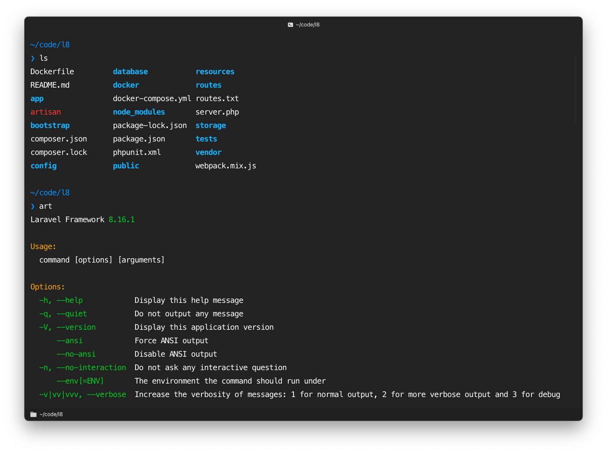

# My Personal dotfiles [](https://twitter.com/intent/tweet?text=My%20Personal%20dotfiles%20By%20@DevMoath%20https://github.com/DevMoath/dotfiles)
## Table of Contents
- [Overview](#overview)
- [What I Use](#what-i-use)
- [How to Install](#how-to-install)

## Overview

My personal dotfiles. It contains tools I use, config, aliases, scripts, and functions.

## What I use

* [Hyper](https://hyper.is/) as terminal
* [Oh My ZSH](https://ohmyz.sh/) as Zsh configuration
* [pure](https://github.com/sindresorhus/pure) as Zsh Theme

## How to Install

> Make sure you finished the setup for [What I Use](#what-i-use) section 

Clone the repo: 

```shell
git clone https://github.com/DevMoath/dotfiles.git
```

cd into the repo: 

```shell
cd dotfiles
```

Finally, run `install.sh` script (it will ask you for confirmation, add `-Y` to skip it)

```shell
./install.sh
```


