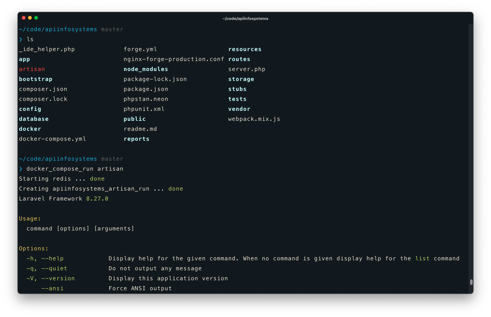
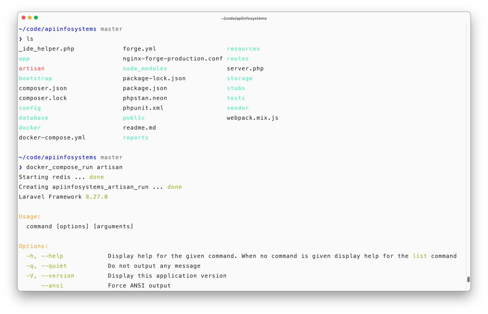

# Moath's dotfiles

## Table of Contents

- [Steps to bootstrap a new Mac](#steps-to-bootstrap-a-new-mac)
- [Example](#example)
- [Useful resources for dotfiles](#useful-resources-for-dotfiles)

## Steps to bootstrap a new Mac

1. Install Apple's Command Line Tools, which are prerequisites for Git and Homebrew.

```shell
xcode-select --install
```

2. Clone repo into new hidden directory.

```shell
git clone https://github.com/DevMoath/dotfiles.git ~/.dotfiles
```

3. Install Homebrew, followed by the software listed in the Brewfile.

```shell
/bin/bash -c "$(curl -fsSL https://raw.githubusercontent.com/Homebrew/install/HEAD/install.sh)"

brew bundle --file ~/.dotfiles/Brewfile
```

4. Install Oh My ZSH

```shell
sh -c "$(curl -fsSL https://raw.github.com/ohmyzsh/ohmyzsh/master/tools/install.sh)"
```

5. Install pure-prompt

```shell
npm install --global pure-prompt
```

6. Install vimrc

```shell
git clone --depth 1 https://github.com/amix/vimrc.git ~/.vim_runtime

sh ~/.vim_runtime/install_awesome_vimrc.sh
```

7. Create symlinks in the Home directory to the real files in the repo.

```shell
ln -s ~/.dotfiles/.zshrc ~/.zshrc
ln -s ~/.dotfiles/.vimrc ~/.vim_runtime/my_configs.vim
ln -s ~/.dotfiles/.gitignore_global ~/.gitignore_global
ln -s ~/.dotfiles/.gitconfig ~/.gitconfig
ln -s ~/.dotfiles/composer.json ~/.composer/composer.json
ln -s ~/.dotfiles/.youtube-dl ~/.config/youtube-dl/config
```

8. Install zsh-syntax-highlighting

```shell
git clone https://github.com/zsh-users/zsh-syntax-highlighting.git $ZSH_CUSTOM/plugins/zsh-syntax-highlighting
```

9. Install composer and npm global packages

```shell
composer global i

xargs npm install --global < ~/.dotfiles/npmfile
```

10. Disable "Last login" message:

```shell
touch ~/.hushlogin 
```

11. Disable restore terminal windows:

```shell
touch ~/.bash_sessions_disable
```

## Example

<p align="center"><b>Dark theme</b></p>



<p align="center"><b>Light theme</b></p>



## Useful resources for dotfiles

* [Dotfiles from Start to Finish-ish](http://dotfiles.eieio.xyz/)
* [~/.dotfiles in 100 Seconds](https://youtu.be/r_MpUP6aKiQ)
* [Vim in 100 Seconds](https://youtu.be/-txKSRn0qeA)
* [Tweets about shell script](https://twitter.com/i/events/1335052425846284288)
* [Set Up a Mac for Development From Scratch](https://laracasts.com/series/setup-a-mac-for-development-from-scratch)
* [Vim Mastery](https://laracasts.com/series/vim-mastery)
* [Bash scripting cheatsheet](https://devhints.io/bash)
* [Your unofficial guide to doing dotfiles on GitHub.](https://github.com/dotfiles/dotfiles.github.com)
